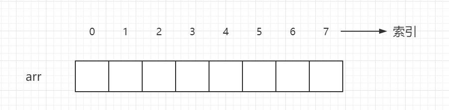

## 数组

- 概念

数组是一个存储相同类型的变量所组成的一个有序集合，数组中每一个变量称为元素，每个元素都有一个对应的索引（索引从0开始）。

数组的存储方式如下：

- 数组在内存中是顺序存储的

内存是由一个个连续的内存单元所组成的，每一个内存单元都对应一个地址，在内存单元中，有些被占用了，有些是空闲的。

数组中的每一个元素，都存储在内存单元中，并且这些内存单元之间紧密排列，既不能打乱存储顺序，也不能跳过某个内存单元进行存储。

- 基于数组进行二次封装

1、读取元素

对于数组来说，读取元素是最简单的操作。由于数组在内存中顺序存储，所以只要给出一个数组的索引，就可以读取到索引对应的元素。

2、修改元素

更新数组中的某一个元素，也是一个非常简单的操作。直接利用数组的索引，就可以把新值赋值给索引对应的元素。

3、插入元素

在数组中插入元素分为三种情况：

尾部插入

这是最简单的情况，直接把插入的元素放在数组的尾部空闲的位置就可以了。

中间插入

稍微复杂一些，在数组中每一个元素都对应一个索引，所以首先先把插入位置的元素和后面的元素向后移动，再把插入的元素插入到对应的索引中。

超范围插入

假如现在有一个长度为10的数组，并且这个数组中已经填满了元素，如果这时还想添加一个元素，该怎么办？
这里就涉及到了扩容机制了，在一开始数组的长度就已经确定了，那么如何扩容呢？
我们可以创建一个新的数组，并且这个新数组的长度是原来的数组的长度的2倍，然后再把旧数组当中的元素插入到新数组当中，这样就实现了数组的扩容。

4、删除元素

删除元素和插入元素的过程正好相反，我们把要删除的元素后面的元素往前移动就可以了。注意：虽然这里不涉及扩容问题，但是如果当前的数组的元素的个数要比数组的长度小很多，是不是就浪费了内存？所以我们可以在这里加入缩容机制，防止浪费内存。

- 数组的优劣势

1、优势

数组拥有高效的随机访问能力，只要给出索引，就可以立即找到对应的元素，CPU预读对缓存友好；

2、劣势

数组的劣势体现在插入元素和删除元素，由于数组的存储方式，导致在插入和删除这两个操作中大量的元素需要被迫移动，从而影响效率。

## 广义表

是由零个或多个原子或子表组成的优先序列，是线性表的推广

广义表中的数据元素可以具有不同的结构，因此，难以用顺序存储结构表示，通常采用链式存储结构，每个数据元素可用一个节点表示。由于广义表中有两种数据元素，因此需要有两种结构的节点——一种是表结点，一种是原子结点