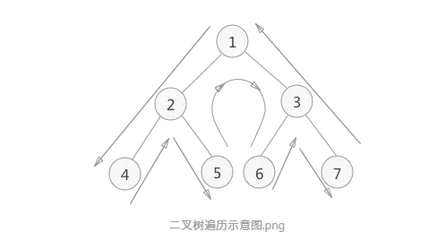
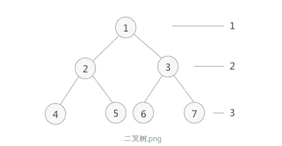
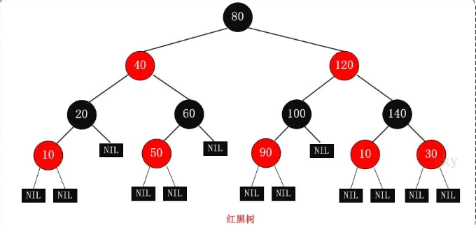
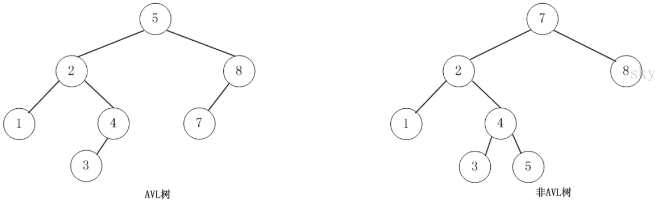
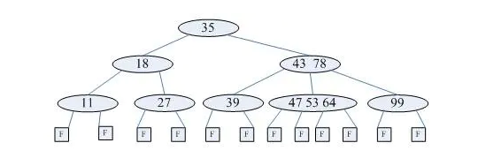
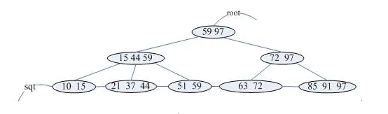
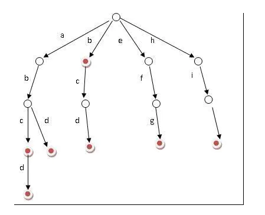

## 树

树结构是一种非线性存储结构，存储的是具有“一对多”关系的数据元素的集合。

树是由根结点和若干棵子树构成的。

在树结构中，对于具有同一个根结点的各个子树，相互之间不能有交集。

- 结点

表示树中的元素，包括数据项及若干指向其子树的分支

- 父结点（双亲结点）、子结点和兄弟结点

A 是 B、C、D 结点的父结点（也称为“双亲结点”），而 B、C、D 都是 A 结点的子结点（也称“孩子结点”）。对于 B、C、D 来说，它们都有相同的父结点，所以它们互为兄弟结点。

- 树根结点（简称“根结点”）

每一个非空树都有且只有一个被称为根的结点。

树根的判断依据为：如果一个结点没有父结点，那么这个结点就是整棵树的根结点。

- 叶子结点

如果结点没有任何子结点，那么此结点称为叶子结点（叶结点）。

度为0的结点

- 子树

像B节点一侧这样的树称为字树

- 空树

如果集合本身为空，那么构成的树就被称为空树

- 结点的度

对于一个结点，拥有的子树数（结点有多少分支）称为结点的度（Degree）

- 结点的层次

从一棵树的树根开始，树根所在层为第一层，根的孩子结点所在的层为第二层，依次类推

树的度：一棵树中最大的结点度数

深度：从上到下度量,经过的边数

高度：从下到上,经过的最大边数

树的性质:树中的结点数等于所有结点的度数加1

- 有序树和无序树

如果树中结点的子树从左到右看，谁在左边，谁在右边，是有规定的，这棵树称为有序树；反之称为无序树

- 森林

由 m（m >= 0）个互不相交的树组成的集合被称为森林。图 1中，分别以 B、C、D 为根结点的三棵子树就可以称为森林

树可以理解为是由根结点和若干子树构成的，而这若干子树本身是一个森林，所以，树还可以理解为是由根结点和森林组成的。用一个式子表示为：

	Tree =（root,F），其中，root 表示树的根结点，F 表示由 m（m >= 0）棵树组成的森林

- 树的种类

数据结构中为了存储和查找的方便，用各种树结构来存储文件

	二叉查找树（二叉排序树）
	平衡二叉树（AVL树）
	红黑树
	B-树
	B+树
	字典树（trie树）
	后缀树
	广义后缀树

## 二叉树

- 二叉树：

1、本身是有序树；
2、树中包含的各个节点的度不能超过 2，即只能是 0、1 或者 2；

- 满二叉树

特殊的完全二叉树,特点——每一层上的结点数都是最大结点数

- 完全二叉树

最后一层的叶子节点都靠左排列，并且除了最后一层，其他层的节点个数都要达到最大,**适合用数组存储节省空间,先序遍历**

- 二叉树的存储结构

二叉树的存储结构有两种，分别为顺序存储和链式存储。

- 遍历二叉树（相对根节点）

a、普通遍历继续分为三种:

	1. 先序遍历：根节点->左子树->右子树
	2. 中序遍历:左子树->根节点->右子数
	3. 后序遍历:左子树->右子数->根节点

三种方式唯一的不同就是访问结点时机的不同，给出一个二叉树，首先需要搞清楚三种遍历方式下访问结点的顺序。

先序遍历是只要线条走到该结点的左方位置时，就操作该结点。所以操作结点的顺序为：

	1 2 4 5 3 6 7

中序遍历是当线条越过结点的左子树，到达该结点的正下方时，才操作该结点。所以操作结点的顺序为：

	4 2 5 1 6 3 7

后序遍历是线条完全走过结点的左右子树，到达该结点的右方范围时，就开始操作该结点。所以操作结点的顺序为：

	4 5 2 6 7 3 1

b、层次遍历:从上到下，从左到右

实现层次遍历二叉树：

	首先，根结点 1 入队；
	根结点 1 出队，出队的同时，将左孩子 2 和右孩子 3 分别入队；
	队头结点 2 出队，出队的同时，将结点 2 的左孩子 4 和右孩子 5 依次入队；
	队头结点 3 出队，出队的同时，将结点 3 的左孩子 6 和右孩子 7 依次入队；
	不断地循环，直至队列内为空

## 二叉查找树

二叉查找树要求，在树中的任意一个节点，左子树值<节点值<右子树值

- 特点

二叉查找树是一种动态查找表，具有这些性质：

	（1）若它的左子树不为空，则左子树上的所有节点的值都小于它的根节点的值；
	（2）若它的右子树不为空，则右子树上所有节点的值都大于它的根节点的值；
	（3）其他的左右子树也分别为二叉查找树；
	（4）二叉查找树是动态查找表，在查找的过程中可见添加和删除相应的元素，在这些操作中需要保持二叉查找树的以上性质。

## 红黑树

红黑树是特殊的二叉查找树，意味着它满足二叉查找树的特征：任意一个节点所包含的键值，大于等于左孩子的键值，小于等于右孩子的键值。

是为解决二叉查找树频繁对数据更新过程中,复杂度退化的问题,性能稳定,O(logn)

- 特点

(1) 每个节点或者是黑色，或者是红色。
(2) 根节点是黑色。
(3) 每个叶子节点是黑色。 [注意：这里叶子节点，是指为空的叶子节点！]
(4) 如果一个节点是红色的，则它的子节点必须是黑色的。
(5) 从一个节点到该节点的子孙节点的所有路径上包含相同数目的黑节点。

注意：

第一，特性(3)中的叶子节点，是只为空(NIL或null)的节点。
第二，特性(5)，确保没有一条路径会比其他路径长出俩倍。因而，红黑树是相对是接近平衡的二叉树

- 为什么工程上喜欢用红黑树而不是AVL树

AVL树每次插入,删除,更新都要调整树,比较复杂,耗时,而红黑树是近似平衡树,不需要每次调整

## 平衡二叉树（AVL Tree）

二叉查找树，也被称为高度平衡树

特点：

	（1）要么是棵空树，要么其根节点左右子树的深度之差的绝对值不超过1；
	（2）其左右子树也都是平衡二叉树；
	（3）二叉树节点的平衡因子定义为该节点的左子树的深度减去右子树的深度。则平衡二叉树的所有节点的平衡因子只可能是-1,0,1。

## B-树

B-树是一种平衡多路查找树，它在文件系统中很有用。一棵m阶B-树（图为4阶B-树）

特点：

	（1）树中每个节点至多有m棵子树；
	（2）若根节点不是叶子节点，则至少有2棵子树；
	（3）除根节点之外的所有非终端节点至少有 m/2 棵子树；
	（4）每个节点中的信息结构为（A0,K1,A1,K2......Kn,An），其中n表示关键字个数，Ki为关键字，Ai为指针；
	（5）所有的叶子节点都出现在同一层次上，且不带任何信息，也是为了保持算法的一致性。

## B+树

B+数是B-树的一种变形，它与B-树的差别在于（图为3阶B+树）

	（1）有n棵子树的节点含有n个关键字；
	（2）所有的叶子节点包含了全部关键字的信息，及指向这些关键字记录的指针，且叶子节点本身按关键字大小自小到大顺序链接；
	（3）所有非终端节点可以看成是索引部分，节点中仅含有其子树（根节点）中最大（或最小）关键字，所有B+树更像一个索引顺序表；
	（4）对B+树进行查找运算，一是从最小关键字起进行顺序查找，二是从根节点开始，进行随机查找。

## Trie树 也叫"字典树"

典树是一种以树形结构保存大量字符串。以便于字符串的统计和查找，经常被搜索引擎系统用于文本词频统计。

它的优点是：利用字符串的公共前缀来节约存储空间，最大限度地减少无谓的字符串比较，查询效率比哈希表高。

特点：

	（1）根节点为空；
	（2）除根节点外，每个节点包含一个字符；
	（3）从根节点到某一节点，路径上经过的字符连接起来，为该节点对应的字符串。
	（4）每个字符串在建立字典树的过程中都要加上一个区分的结束符，避免某个短字符串正好是某个长字符串的前缀而淹没。

## 后缀树 vs 广义后缀树

所谓后缀树，就是包含一则字符串所有后缀的压缩了的字典树

广义后缀树是好几个字符串的的所有后缀组成的字典树，同样每个字符串的所有后缀都具有一个相同的结束符，不同字符串的结束符不同。

## 三种基本的存储引擎

- 哈希存储引擎  

是哈希表的持久化实现，支持增、删、改以及随机读取操作，**但不支持顺序扫描**，对应的存储系统为key-value存储系统。对于key-value的插入以及查询，哈希表的复杂度都是O(1)，明显比树的操作O(n)快,如果不需要有序的遍历数据，哈希表就是your Mr.Right

- B树存储引擎

是B树的持久化实现，不仅支持单条记录的增、删、读、改操作，还支持顺序扫描（B+树的叶子节点之间的指针），对应的存储系统就是关系数据库（Mysql等）。

- LSM树（Log-Structured Merge Tree）存储引擎

和B树存储引擎一样，同样支持增、删、读、改、顺序扫描操作。而且通过批量存储技术规避磁盘随机写入问题。**当然凡事有利有弊，LSM树和B+树相比，LSM树牺牲了部分读性能，用来大幅提高写性能。**
      

## LSM树 与 B+Tree

产品:HBase, Cassandra, LevelDB, SQLite,甚至在mangodb3.0中也带了一个可选的LSM引擎

设计背景:顺序读写磁盘（不管是SATA还是SSD）快于随机读写主存，而且快至少三个数量级。这说明我们要避免随机读写，最好设计成顺序读写

LSM树的设计思想非常朴素：将对数据的修改增量保持在内存中，达到指定的大小限制后将这些修改操作批量写入磁盘,，不过读取的时候稍微麻烦，需要合并磁盘中历史数据和内存中最近修改操作，所以写入性能大大提升，读取时可能需要先看是否命中内存，否则需要访问较多的磁盘文件。极端的说，基于LSM树实现的HBase的写性能比Mysql高了一个数量级，读性能低了一个数量级

它的原理是把一颗大树拆分成N棵小树， 它首先写入到内存中（内存没有寻道速度的问题，随机写的性能得到大幅提升），在内存中构建一颗有序小树，随着小树越来越大，内存的小树会flush到磁盘上。当读时，由于不知道数据在哪棵小树上，因此必须遍历所有的小树，但在每颗小树内部数据是有序的

以上就是LSM树最本质的原理，有了原理，再看具体的技术就很简单了。

1. 首先说说为什么要有WAL（Write Ahead Log），很简单，因为数据是先写到内存中，如果断电，内存中的数据会丢失，因此为了保护内存中的数据，需要在磁盘上先记录logfile，当内存中的数据flush到磁盘上时，就可以抛弃相应的Logfile。

2. 什么是memstore, storefile？很简单，上面说过，LSM树就是一堆小树，在内存中的小树即memstore，每次flush，内存中的memstore变成磁盘上一个新的storefile。

3. 为什么会有compact？很简单，随着小树越来越多，读的性能会越来越差，数据也有冗余,因此需要在适当的时候，对磁盘中的小树进行merge，多棵小树变成一颗大树。

- LSM tree 操作流程如下：

1. 数据写入和更新时首先写入位于内存里的数据结构。为了避免数据丢失也会先写到 WAL 文件中。
2. 内存里的数据结构会定时或者达到固定大小会刷到磁盘。这些磁盘上的文件不会被修改。
3. 随着磁盘上积累的文件越来越多，会定时的进行合并操作，消除冗余数据，减少文件数量。

## 参考地址

[树](https://www.jianshu.com/p/80f5f5cb11fe)

[树的详解](https://www.jianshu.com/p/80f5f5cb11fe)

[二叉树](https://www.jianshu.com/p/658df30698bc)

[二叉树遍历](https://www.jianshu.com/p/403efe689e5a)

[红黑树](https://www.jianshu.com/p/85c4a8fc9f47)

[AVL TREE](https://www.jianshu.com/p/7622e1bb796c)

[LSM树由来、设计思想以及应用到HBase的索引](https://www.cnblogs.com/yanghuahui/p/3483754.html)

