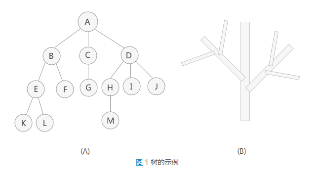
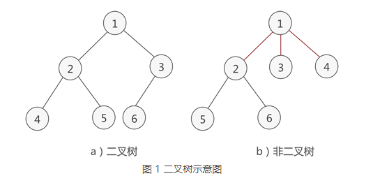

## 树

树结构是一种非线性存储结构，存储的是具有“一对多”关系的数据元素的集合。

结点：表示树中的元素，包括数据项及若干指向其子树的分支

结点的度：结点拥有的子树树

树的度：一棵树中最大的结点度数

深度：从上到下度量,经过的边数

高度：从下到上,经过的最大边数

叶子结点：度为0的结点

树的性质:树中的结点数等于所有结点的度数加1

### 三种基本的存储引擎

- 哈希存储引擎  

是哈希表的持久化实现，支持增、删、改以及随机读取操作，**但不支持顺序扫描**，对应的存储系统为key-value存储系统。对于key-value的插入以及查询，哈希表的复杂度都是O(1)，明显比树的操作O(n)快,如果不需要有序的遍历数据，哈希表就是your Mr.Right

- B树存储引擎

是B树的持久化实现，不仅支持单条记录的增、删、读、改操作，还支持顺序扫描（B+树的叶子节点之间的指针），对应的存储系统就是关系数据库（Mysql等）。

- LSM树（Log-Structured Merge Tree）存储引擎

和B树存储引擎一样，同样支持增、删、读、改、顺序扫描操作。而且通过批量存储技术规避磁盘随机写入问题。**当然凡事有利有弊，LSM树和B+树相比，LSM树牺牲了部分读性能，用来大幅提高写性能。**

## 二叉树

- 二叉树：

1、本身是有序树；
2、树中包含的各个节点的度不能超过 2，即只能是 0、1 或者 2；

- 满二叉树

特殊的完全二叉树,特点——每一层上的结点数都是最大结点数

- 完全二叉树

最后一层的叶子节点都靠左排列，并且除了最后一层，其他层的节点个数都要达到最大,**适合用数组存储节省空间,先序遍历**

- 二叉树的存储结构

二叉树的存储结构有两种，分别为顺序存储和链式存储。

- 遍历二叉树（相对根节点）

1. 先序遍历：根节点->左子树->右子树
2. 中序遍历:左子树->根节点->右子数
3. 后序遍历:左子树->右子数->根节点
4. 层次遍历:从上到下，从左到右

## 二叉查找树

二叉查找树要求，在树中的任意一个节点，左子树值<节点值<右子树值

- 特性

中序遍历二叉查找树，可以输出有序的数据序列，时间复杂度是O(n)

- 支持重复数据的二叉查找树

1. 节点存对象,不存值
2. 值相同,放右子树,当要查找数据的时候，遇到值相同的节点，我们并不停止查找操作,只到叶子节点

- 为什么有散列表还需要二叉查找树

1. 散列表数据无序存储,无法输出有序数据
2. 散列表扩容耗时,有散列冲突,不稳定
3. 散列表构造复杂(散列函数的设计,扩容,缩容,散列冲突)

## 红黑树

一种近视平衡的二叉查找树,是为解决二叉查找树频繁对数据更新过程中,复杂度退化的问题,性能稳定,O(logn)

- 特点

        根节点是黑色
        每个叶子节点都是黑色的空节点(NIL)
        任何相邻的节点都不能同时为红色
        每个节点,到其可达的叶子节点的所有路劲,都包含相同的黑色节点
        
- 为什么工程上喜欢用红黑树而不是AVL树

AVL树每次插入,删除,更新都要调整树,比较复杂,耗时,而红黑树是近似平衡树,不需要每次调整     

## Trie树 也叫"字典树"

1. 就是利用字符串之间的公共前缀，将重复的前缀合并在一起
2. 主要操作:构造一个Trie树 在Trie树中查找一个字符串
3. Trie树不如红黑树和散列表适合精确匹配,它更加**适合前缀匹配**
4. 比较耗内存
5. 时间复杂度是 O(k)，k 表示要匹配的字符串的长度
6. 应用场景:字符串的字符集不能太大，前缀重合比较多
      

## BTree和B+Tree

[详解](https://www.cnblogs.com/vianzhang/p/7922426.html)

B树是为磁盘存储而专门设计的一类平衡搜索树

B+树中的B代表平衡（balance）
B+树最大的性能问题是为了读取有序性,插入会产生大量的随机IO,因为磁盘寻道速度慢

- 典型应用

### 平衡二叉树（AVL Tree）

### LSM树 与 B+ Tree

产品:HBase, Cassandra, LevelDB, SQLite,甚至在mangodb3.0中也带了一个可选的LSM引擎

[LSM树由来、设计思想以及应用到HBase的索引](https://www.cnblogs.com/yanghuahui/p/3483754.html)
[概念](https://www.cnblogs.com/bonelee/p/6244810.html)

设计背景:顺序读写磁盘（不管是SATA还是SSD）快于随机读写主存，而且快至少三个数量级。这说明我们要避免随机读写，最好设计成顺序读写

LSM树的设计思想非常朴素：将对数据的修改增量保持在内存中，达到指定的大小限制后将这些修改操作批量写入磁盘,，不过读取的时候稍微麻烦，需要合并磁盘中历史数据和内存中最近修改操作，所以写入性能大大提升，读取时可能需要先看是否命中内存，否则需要访问较多的磁盘文件。极端的说，基于LSM树实现的HBase的写性能比Mysql高了一个数量级，读性能低了一个数量级

它的原理是把一颗大树拆分成N棵小树， 它首先写入到内存中（内存没有寻道速度的问题，随机写的性能得到大幅提升），在内存中构建一颗有序小树，随着小树越来越大，内存的小树会flush到磁盘上。当读时，由于不知道数据在哪棵小树上，因此必须遍历所有的小树，但在每颗小树内部数据是有序的

以上就是LSM树最本质的原理，有了原理，再看具体的技术就很简单了。

1. 首先说说为什么要有WAL（Write Ahead Log），很简单，因为数据是先写到内存中，如果断电，内存中的数据会丢失，因此为了保护内存中的数据，需要在磁盘上先记录logfile，当内存中的数据flush到磁盘上时，就可以抛弃相应的Logfile。

2. 什么是memstore, storefile？很简单，上面说过，LSM树就是一堆小树，在内存中的小树即memstore，每次flush，内存中的memstore变成磁盘上一个新的storefile。

3. 为什么会有compact？很简单，随着小树越来越多，读的性能会越来越差，数据也有冗余,因此需要在适当的时候，对磁盘中的小树进行merge，多棵小树变成一颗大树。

#### LSM tree 操作流程如下：

1. 数据写入和更新时首先写入位于内存里的数据结构。为了避免数据丢失也会先写到 WAL 文件中。
2. 内存里的数据结构会定时或者达到固定大小会刷到磁盘。这些磁盘上的文件不会被修改。
3. 随着磁盘上积累的文件越来越多，会定时的进行合并操作，消除冗余数据，减少文件数量。

