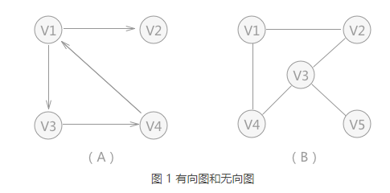
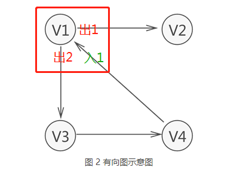
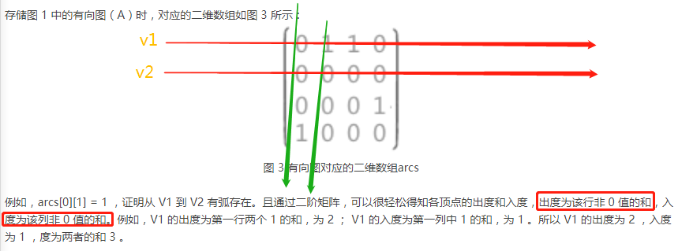
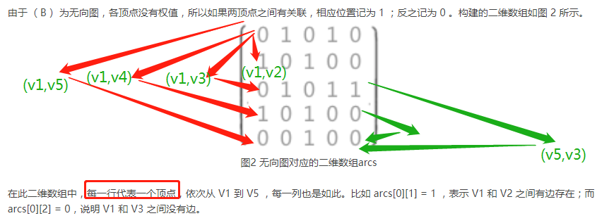
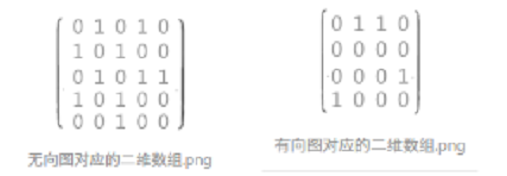

## 图

在图形结构中，结点之间关系可以是任意的，图中任意两个数据元素之间都可能相关.

### 图的基本常识

- 弧头和弧尾

有向图中，无箭头一端的顶点通常被称为"初始点"或"弧尾"，箭头直线的顶点被称为"终端点"或"弧头"。

- 入度和出度 (简记： 出入度-> 始终点-> 【出----->入】 )

出度就是：有向图的某个顶点作为起点(弧尾)的次数和。

入度就是：有向图的某个顶点作为终点(弧头)的次数和。

- (V1,V2) 和 <V1,V2> 的区别

无向图中描述两顶点（V1 和 V2）之间的关系可以用 (V1,V2) 来表示，而有向图中描述从 V1 到 V2 的"单向"关系用 <V1,V2> 来表示。

- 集合 VR 的含义

并且，图中习惯用 VR 表示图中所有顶点之间关系的集合。

	图A中有向图的集合 VR={<v1,v2>,<v1,v3>,<v3,v4>,<v4,v1>}
	图B中无向图的集合 VR={(v1,v2),(v1,v4),(v1,v3),(v3,v4)}

- 路径和回路

无论是无向图还是有向图，从一个顶点到另一顶点途径的所有顶点组成的序列（包含这两个顶点），称为一条路径。

如果路径中第一个顶点和最后一个顶点相同，则此路径称为"回路"（或"环"）。

- 图存储结构的分类

根据不同的特征，图又可分为完全图，连通图、稀疏图和稠密图

图算是个较为难理解的结构形式了。大致我们可以分为两个大类：

	1、通过数组实现
	2、通过链表实现

二维数组表示图各个点点之间弧或边的关系

	

注意：

	1、图，包括有向图和无向图；
	2、网，是指带权的图，包括无向网和有向网。
	3、存储方式的不同，指的是：在使用二维数组**存储图**中顶点之间的关系时，如果顶点之间存在边或弧，在相应位置用 1 表示，反之用 0 表示；
	3、如果使用二维数组**存储网**中顶点之间的关系，顶点之间如果有边或者弧的存在，在数组的相应位置存储其权值；反之用 0 表示。

### 图的存储结构

图的结构的存储这里我们介绍四种基本形式：

	1、邻接矩阵（数组）
	2、邻接表（链表）
	3、邻接多重表（链表）
	4、十字链表（链表）

#### 邻接矩阵(顺序存储)

邻接矩阵是表示顶点之间相邻关系的矩阵

1. 顶点数组：存储顶点信息
2. 边数组:存储顶点数组中2个顶点关系和权
3. 图{顶点数组，边数组，顶点数，边数，图类型}

优点：容易实现图的操作，如判断顶点间是否有边（弧）
缺点: 对稀疏图浪费空间，查找顶点的度，需要扫描整张边数组，效率低，对顶点的相关操作

#### 邻接表(链式存储)

一种顺序分配与链式分配相结合的存储方法。它包括两部分：一部分是单链表，用来存放边的信息；另一部分是数组，主要用来存放顶点本身的数据信息

1. 表头结点：存储顶点信息(data)和第一个邻接点地址(firstarc)，一般顺序存储在**一个数组中**
2. 表中结点：存储表头结点在数组中的位置和下一个结点的指针，可存储权值
3. 图{表头结点数组，顶点数，边数，图类型}

- 特点

1、出度为各自链表中的结点数，入度需要遍历整个表的结点，还有一种方法，求入度，建立一个逆邻接表
2、稀疏图存储时，比使用邻接矩阵节省空间

1. 优点:空间利用率高，容易找顶点的邻接点
2. 缺点:判断2顶点间是否有弧，需搜索2结点对应的单链表

#### 逆领接表

为了解决领接表的缺点,查找入度需要遍历所有的顶点对应的边

#### 十字链表(链式存储)

十字链表是有向图的另一种链式存储结构。可以看成是将有向图的邻接表和逆邻接表结合起来得到的一种链表。在十字链表中，每条弧和每个顶点分别对应着一个结点

1. 顶点结点:存储顶点信息(data) 一个弧头结点指针(firstin)  一个弧尾结点指针(firstout)
2. 弧结点:tailvex 和 headvex 分别存储的是弧尾和弧头对应的顶点在数组中的位置下标； hlink 和 tlink 为指针域，分别指向弧头相同的下一个弧和弧尾相同的下一个弧； info 为指针域，存储的是该弧具有的相关信息，例如权值等
3. 图{顶点结点数组，弧数，顶点数}

- 特点

1. 存储的是有向图或者有向网
2. 求入度出度方便，入度为弧头的数量，出度为弧尾的数量
3. 程序中构建链表对于每个新初始化的结点采用头插法进行插入

#### 邻接多重表(链式存储)

邻接多重表是无向图的另一种链式存储结构。邻接多重表和十字链表一样，每条边和每个顶点分别对应着一个结点

使用邻接表解决在无向图中删除某两个结点之间的边的操作时，由于表示边的结点分别处在两个顶点为头结点的链表中，所以需要都找到并删除，操作比较麻烦。处理类似这种操作，使用邻接多重表会更合适。

1. 表结点构成：

mark 为标志域，作用是标记某结点是否已经被操作过，例如在遍历各结点时， mark 域为 0 表示还未遍历；mark 域为 1 表示该结点遍历过；
ivex 和 jvex 分别表示该结点表示的边两端的顶点在数组中的位置下标； ilink 指向下一条与 ivex 相关的边；
jlink 指向下一条与 jvex 相关的边；
info 指向与该边相关的信息。

2. 顶点结点构成：

data 为该顶点的数据域；
firstedge 为指向第一条跟该顶点有关系的边。

#### 总结

1. 邻接表适用于所有的图结构，无论是有向图（网）还是无向图（网），存储结构较为简单，但是在存储一些问题时，例如计算某顶点的度，需要通过遍历的方式自己求得
2. 十字链表适用于有向图（网）的存储，使用该方式存储的有向图，可以很容易计算出顶点的出度和入度，只需要知道对应链表中的结点个数即可
3. 邻接多重表适用于无向图（网）的存储，该方式避免了使用邻接表存储无向图时出现的存储空间浪费的现象，同时相比邻接表存储无向图，更方便了某些边操作（遍历、删除等）的实现

## 图的遍历

- 图的暴力搜索

时间复杂度都是 O(E)，空间复杂度是 O(V)

1.  深度优先搜索（DFS）

    - 回溯思想
    - 借助栈来实现
  
2.  广度优先搜索（WFS）

    - 地毯式层层推进
    - 借助队列来实现

## 参考地址

[图的概念](http://data.biancheng.net/view/36.html)

[图的存储](https://blog.csdn.net/qq_22238021/article/details/78281939)
