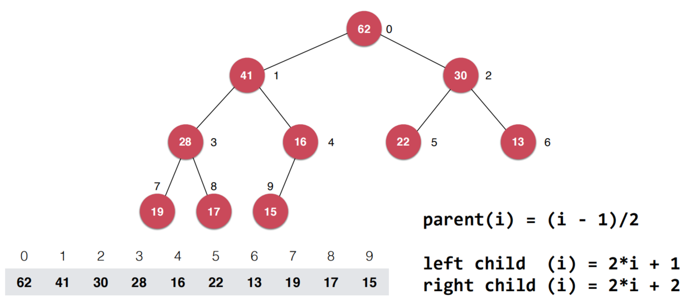

## 堆

- 概念

1、堆是完全二叉树的数组表示法。堆中每一个节点的值都必须大于等于（或小于等于）其子树中每个节点。

2、堆可以分为最大堆和最小堆。

最大堆：每个父节点都大于孩子节点。
最小堆：每个父节点都小于孩子节点。

堆的根节点叫作堆顶。

最大堆和最小堆的特点决定了，最大堆的堆顶是整个堆中的最大元素。最小堆的堆顶是整个堆中的最小元素。

3、插入一个数据的时候，我们把新插入的数据放到数组的最后，然后从从下往上堆化；删除堆顶数据的时候，我们把数组中的最后一个元素放到堆顶，然后从上往下堆化。这两个操作时间复杂度都是O(logn)。

注意：二叉堆虽然是一个完全二叉树，但它的存储方式并不是链式存储，而是顺序存储。换句话说，二叉堆的所有节点都存储在数组当中。如图:

                        
                                     
- 为什么堆排序没有快速排序快

1、堆排序数据访问的方式没有快速排序友好,跳着访问,对cpu不友好    
                           
2、对于同样的数据，在排序过程中，堆排序算法的数据交换次数要多于快速排序
  
- 堆的应用

1. 优先级队列(如:高性能定时器)

2. 求TopK问题(静态数据:维护一个K的小顶堆,依次比较[O(nlogK)],动态数据类似)

3. 求动态数据中位数(维护一个大顶堆,一个小顶堆,而且小顶堆中的元素都大于大顶堆中的元素,通过动态调整堆大小来满足数据平衡)