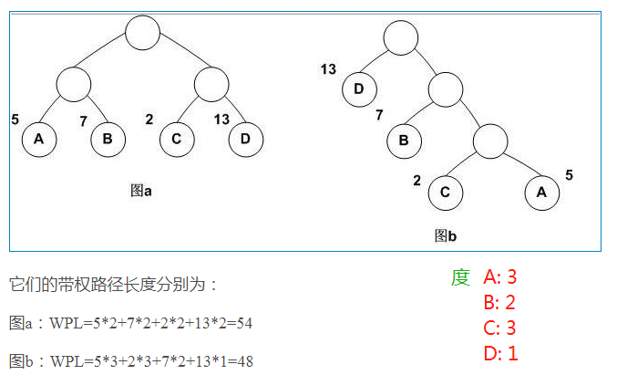
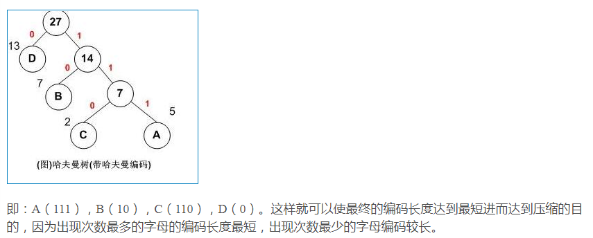
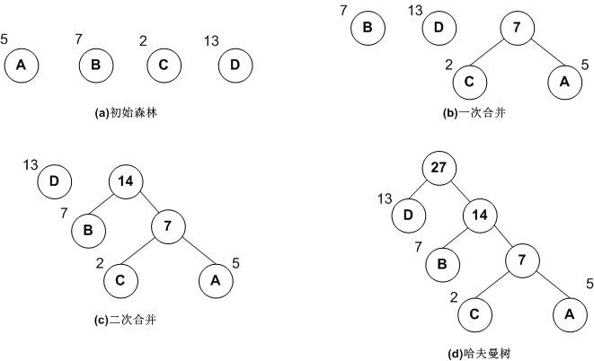

## 哈夫曼树

路径： 树中一个结点到另一个结点之间的分支构成这两个结点之间的路径。

路径长度：路径上的分枝数目称作路径长度。

树的路径长度：从树根到每一个结点的路径长度之和。

结点的带权路径长度：在一棵树中，如果其结点上附带有一个权值，通常把该结点的路径长度与该结点上的权值之积称为该结点的带权路径长度（weighted path length）。

- 哈夫曼树

哈夫曼树是一种带权路径长度最短的二叉树，也称为最优二叉树。

由此说明哈夫曼树是带树路径最短的树，也称最优二叉树。

- 哈夫曼编码

利用哈夫曼树求得的用于通信的二进制编码称为哈夫曼编码，树中从根节点到每个叶子节点都有一条路径，对于每个节点，取左子树编码为“0”，右子树编码为“1” ，取每条路径上的“0”、“1”组成的序列即为对应叶子节点对应的编码，即哈夫曼编码。

- 哈夫曼树的构造步骤

举个粟子说明，字母ABCD出现的概率依次为5、7、2和13，代表其权重。以下图示图解过程：

    1、初始化： 根据给定的n个权值{w1,w2,…wn}构成n棵二叉树的集合F={T1,T2,..,Tn}，其中每棵二叉树Ti中只有一个带权wi的根结点，左右子树均空；
    2、 找最小树：在F中选择两棵根结点权值最小的树作为左右子树构造一棵新的二叉树，且至新的二叉树的根结点的权值为其左右子树上根结点的权值之和；
    3、删除与加入：在F中删除这两棵树，并将新的二叉树加入F中；
    4、判断：重复前两步（2和3），直到F中只含有一棵树为止。