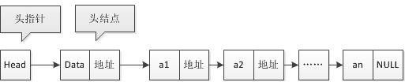

## 链表 （linked-list）

- 概念：

链表实际上是线性表的链式存储结构，与数组不同的是，它是用一组任意的存储单元来存储线性表中的数据，存储单元不一定是连续的，且链表的长度不是固定的，链表数据的这一特点使其可以非常的方便地实现节点的插入和删除操作；

链表的每个元素称为一个节点，每个节点都可以存储在内存中的不同的位置，为了表示每个元素与后继元素的逻辑关系，以便构成“一个节点链着一个节点”的链式存储结构；

除了存储元素本身的信息外，还要存储其直接后继信息，因此，每个节点都包含两个部分，第一部分称为链表的数据区域，用于存储元素本身的数据信息，这里用data表示，它不局限于一个成员数据，也可是多个成员数据，第二部分是一个结构体指针，称为链表的指针域，用于存储其直接后继的节点信息，这里用next表示，next的值实际上就是下一个节点的地址，当前节点为末节点时，next的值设为空指针。

像上面这种只包含一个指针域、由n个节点链接形成的链表，就称为线型链表或者单向链表，链表只能顺序访问，不能随机访问，链表这种存储方式最大缺点就是容易出现断链，一旦链表中某个节点的指针域数据丢失，那么意味着将无法找到下一个节点，该节点后面的数据将全部丢失。                     

- 分类

1. 单向链表：

2. 循环链表:表中的尾节点指向头节点，形成一个环，操作和线性链表基本一致，没有NULL指针，故终止条件为，是否等于某一个指定的指针

3. 双向链表:双向链表是在单链表的每个结点里再增加一个指向其直接前驱的指针域prior。这样就形成了链表中有两个方向不同的链

- 注意点

1.无论链表是否为空，头指针均不为空。头指针是链表的必要元素

2.链表可以没有头节点，但不能没有头指针，头指针是链表的必要元素