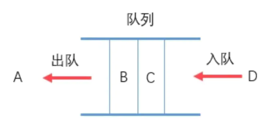
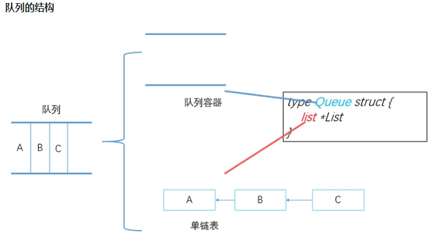

## 队列(queue)

- 概念

队列是一种特殊的线性表，特殊之处在于它只允许在表的前端（front）进行删除操作，而在表的后端（rear）进行插入操作，和栈一样，队列是一种操作受限制的线性表。进行插入操作的端称为队尾，进行删除操作的端称为队头。

- 队列的结构

- 队列的先进先出原则

队列从一端存入数据，另一端调取数据的原则称为“先进先出”原则。（first in first out，简称“FIFO”）

- 队列的实现方式

队列的实现同样有两种方式：顺序存储和链式存储。

两者的区别同样在于数据元素在物理存储结构上的不同

- 队列的顺序表示和实现

使用顺序存储结构表示队列时，首先申请足够大的内存空间建立一个数组，除此之外，为了满足队列从队尾存入数据元素，从队头删除数据元素，还需要定义两个指针分别作为头指针和尾指针。

当有数据元素进入队列时，将数据元素存放到队尾指针指向的位置，然后队尾指针增加 1；
当删除对头元素（即使想删除的是队列中的元素，也必须从队头开始一个个的删除）时，只需要移动头指针的位置就可以了。

顺序表示是在数组中操作数据元素，由于数组本身有下标，所以队列的头指针和尾指针可以用数组下标来代替，
既实现了目的，又简化了程序。

- 顺序存储存在的问题

当使用线性表的顺序表示实现队列时，由于按照先进先出的原则，队列的队尾一直不断的添加数据元素，队头不断的删除数据元素。由于数组申请的空间有限，到某一时间点，就会出现 rear 队列尾指针到了数组的最后一个存储位置，如果继续存储，由于 rear 指针无法后移，就会出错。

- 顺序存储的升级版

使用数组存取数据元素时，可以将数组申请的空间想象成首尾连接的环状空间使用。例如，在申请的内存空间大小为 5 的情况下，将数字 1-6 进队后再出队（普通方式中 6 是无法进队的）：

在使用循环队列判断数组是否已满时，出现下面情况：

当队列为空时，队列的头指针等于队列的尾指针
当数组满员时，队列的头指针等于队列的尾指针

    要将空队列和队列满的情况区分开，办法是：牺牲掉数组中的一个存储空间，
    判断数组满员的条件是：尾指针的下一个位置和头指针相遇，就说明数组满了

- 队列的链式表示和实现——“链队列”

队列的链式存储是在链表的基础上，按照“先进先出”的原则操作数据元素。

- 链队列注意事项

在使用链队列时，最简便的方法就是链表的表头一端表示队列的队头，表的另一端表示队列的队尾，这样的设置会使程序更简单。

反过来的话，队列在增加元素的时候，要采用头插法，在删除数据元素的时候，由于要先进先出，需要删除链表最末端的结点，就需要将倒数第二个结点的next指向NULL，这个过程是需要遍历链表的。

另外需要注意的是，在删除队列中数据元素的时候，每次都需要判断队列是否为空，这就需要寻找一个判断队列为空的条件：
1、如果头结点的指针域为NULL，说明队列为空。
2、如果队头和队尾指针都指向头结点，说明队列为空。

使用链队列解决问题时，要避免“野指针”的出现：

当删除最后一个数据元素时，由于一贯地认为数据元素出队列只跟队头指针有关系，会忽略队尾指针。
当链队列中只剩有一个数据元素时，队尾指针指向的就是这个数据元素，被删除后，队尾指针指向的内存空间被释放，还有可能给别的程序使用。这时候，队尾指针如果不进行重定义，就会变成“野指针”。

- 注意

简述来源于C++，指针问题需要区别对待