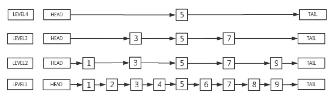

## 跳表 (skipList)

- 概念

跳跃链表是对链表的改进，链表虽然节省空间，但是查找时间复杂度为O（n），效率比较低。 跳跃链表的查找、插入、删除等操作的期望时间复杂度为O(logn)，效率比链表提高了很多。 

跳表的基本性质

    有很多层结构组成
    每一层都是一个有序的链表
    最底层(level 0)的链表包含所有元素
    如果一个元素出现在level i的链表中，则在level i之下的链表都会出现
    每个节点包含两个指针，一个指向同一链表的下一个元素，一个指向下面一层的元素

[使用golang简单实现跳跃表SkipList](https://www.jianshu.com/p/400d24e9daa0?from=timeline&isappinstalled=0)