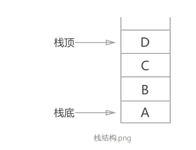

## 栈 (stack)

- 概念

栈，线性表的一种特殊的存储结构。与学习过的线性表的不同之处在于栈只能从表的固定一端对数据进行插入和删除操作，另一端是封死的。

- “先进后出”原则

使用栈存储数据元素，对数据元素的“存”和“取”有严格的规定：数据按一定的顺序存储到栈中，当需要调取栈中某数据元素时，需要将在该数据元素之后进栈的先出栈，该数据元素才能从栈中提取出来。

- 栈操作数据元素的方法

栈操作数据元素只有两种动作：

数据元素用栈的数据结构存储起来，称为“入栈”，也叫“压栈”。

数据元素由于某种原因需要从栈结构中提取出来，称为“出栈”，也叫“弹栈”。

- 栈的存储

1、顺序栈:利用一组地址连续的存储单元依次存放自栈底到栈顶的数据元素

2、链栈: 采用链表作为存储结构实现的栈。为便于操作，采用带头结点的单链表实现栈,因为栈的插入和删除操作仅限制在表头位置进行，所以链表的表头指针就作为栈顶指针

两者的区别：

在于存储的数据元素在物理结构上是否是相互紧挨着的。顺序栈存储元素预先申请连续的存储单元；链栈需要即申请，数据元素不紧挨着。

- 栈的"上溢"和"下溢"

栈存储结构调取栈中数据元素时，要避免出现“上溢”和“下溢”的情况：

“上溢”：在栈已经存满数据元素的情况下，如果继续向栈内存入数据，栈存储就会出错。

“下溢”：在栈内为空的状态下，如果对栈继续进行取数据的操作，就会出错。

- 顺序栈

顺序栈的实现采用的是数组。

在顺序栈中设定一个随时指向栈顶元素的变量（一般命名为 top ），当 top 的值为 -1 时，说明数组中没有数据，即栈中没有数据元素，为“空栈”；只要数据元素进栈，top 就加 1 ；数据元素出栈， top 就减 1 。

- 链栈

链栈，用线性表的链式存储结构实现。

链栈一般不需要创建头结点，头结点会增加程序的复杂性，只需要创建一个头指针就可以了。

用链表表示栈时，用链表头结点的一端作为栈的栈顶端，这样做的好处是当数据元素压栈或者弹栈时，直接使用头指针就可以完成，不需要增设额外的指针。

- 栈的实际应用

1、无处不在的撤销操作

2、程序调用的系统栈

3、括号匹配算法

在编写代码的时候，经常会用到两种括号：圆括号 “()” 和大括号 “{}” 。不管使用哪种括号，程序编译没有问题的其中一个重要因素就是所使用的括号是否能够匹配上.

在编写程序时，括号可以嵌套，即： “({()})” 这种形式，但 “({)” 或者 “({}” 都不符合要求。

括号匹配要求：

给出任意搭配的括号，判断是否匹配。

设计思路

    如果碰到的是左圆括号或者左大括号，直接压栈；
    如果碰到的是右圆括号或者右大括号，就直接和栈顶元素配对：如果匹配，栈顶元素弹栈；反之，括号不匹配；

[数据结构— 栈](https://www.jianshu.com/p/bb3a83eaa49b)